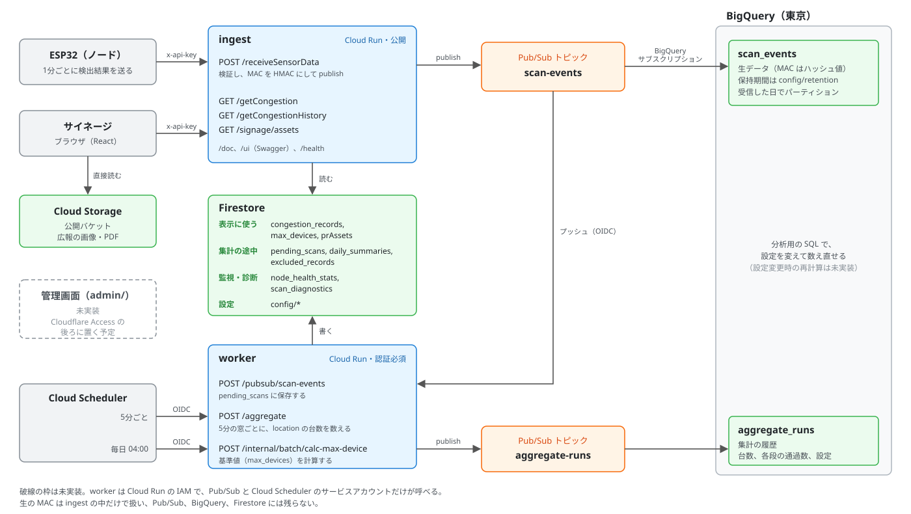

# Fun Now and Futureバックエンドの概要

キャンパスの混雑度をサイネージに出すシステム「Fun Now and Future」の、バックエンドの全体像。ここには要点だけを書き、詳しいことは、リンク先（ADR、README、Swagger、Issue）に書いてある。

## 何をするか

- 食堂やバス停に置いたESP32が、周りのBLE端末を検出して、1分ごとにバックエンドへ送る
- バックエンドは、5分ごとに場所ごとの台数を数え、その場所・曜日のいつもの混み具合（基準値）と比べて、混雑度を1〜9で出す
- サイネージは、混雑度と広報の画像を、バックエンドから受け取って表示する

担当は、バックエンド（このリポジトリ）、フロント（サイネージ。[Fun_NowAndFuture_demo](https://github.com/Funcy-ICT/Fun_NowAndFuture_demo)）、ハード（ESP32のファームウェア）に分かれている。管理画面（`admin/`）もこのリポジトリにある。

## 構成図

## 要点と、詳しく書いてある場所

| 項目 | 要点 | 詳しくは |
| --- | --- | --- |
| データの流れ | 受信したデータはPub/Subを通り、生データはBigQueryに、集計に使う分はFirestoreに入る。受信（`ingest`）と処理（`worker`）は別のCloud Runサービス | [ADR 0010](adr/0010-raw-data-to-bigquery-via-pubsub.md)、READMEの「サービスの分け方」「内部用のエンドポイント」 |
| 保存の単位 | ESP32のPOST 1回分を、1ドキュメントにまとめる | [ADR 0003](adr/0003-pending-scans-one-document-per-post.md) |
| 数える対象 | 受信した端末はすべて残し、数えるのはAppleの本体端末（Nearby Infoを送るもの）だけ。絞り込みは集計のときに行い、条件は設定で変えられる | [ADR 0004](adr/0004-count-target-filter-and-accessory-exclusion.md)、[ADR 0007](adr/0007-filter-pipeline.md) |
| 混雑度の決め方 | 場所・曜日ごとの基準値に対する比を、1〜9にする。基準値は毎日のバッチで、休業日やノードが止まった日を除いて計算する | [ADR 0008](adr/0008-congestion-level-and-baseline.md)、[ADR 0009](adr/0009-baseline-valid-days-and-lookback.md) |
| 混雑度の読み方 | `level`は場所をまたいで比べられない。`level`が`null`のときは、`stale`でデータが古いのか、基準値がまだ無いのかを見分ける | [#25](https://github.com/Funcy-ICT/fun-now-and-future-backend/issues/25)、Swaggerの`CongestionStatus` |
| 設置してすぐの期間 | 基準値が揃うまで、数週間は`level`が`null`のまま。デモでは基準値を手で入れる | READMEの「基準値（max_devices）の手動投入」 |
| 広報の画像 | 画像は公開バケットから直接配る。APIが返すのは、掲載中のものの一覧とURLだけ | [ADR 0006](adr/0006-signage-asset-delivery.md) |
| MACアドレスの扱い | 受信した時点で、鍵付きのハッシュ（HMAC）にする。生のMACは保存せず、ログにも出さない。実際のMACや`rawData`を、テストのデータとしてコミットしない | [ADR 0010](adr/0010-raw-data-to-bigquery-via-pubsub.md)、[#36](https://github.com/Funcy-ICT/fun-now-and-future-backend/issues/36)の「注意」 |
| 時刻 | APIが返す時刻はUTC。曜日と稼働時間帯（既定は7〜22時）は、日本時間で判定する。集計の窓は、ESP32の時刻ではなく、受け取った時刻で決める | Swaggerの`windowStart`、READMEの「設定（`config/baseline`）」 |
| 技術の選び方 | Hono、Cloud Runと層の分け方、管理画面のUI | [ADR 0001](adr/0001-backend-language-and-framework.md)、[ADR 0002](adr/0002-cloud-run-and-layered-architecture.md)、[ADR 0005](adr/0005-admin-ui-library.md) |
| ハード向け | 送信の仕様と、ハード担当に確認したいこと | [#35](https://github.com/Funcy-ICT/fun-now-and-future-backend/issues/35) |
| フロント向け | サイネージから呼ぶAPIと、一緒に決めたいこと | [#56](https://github.com/Funcy-ICT/fun-now-and-future-backend/issues/56) |
| 今の状態と、残っている作業 | デプロイの状況、未実装のもの | [#57](https://github.com/Funcy-ICT/fun-now-and-future-backend/issues/57)（ピン留め）。状態はそこだけで更新する |

## 仕様の置き場所

| 知りたいこと | 見る場所 |
| --- | --- |
| APIのリクエストとレスポンスの形 | Swagger（`/ui`、`/doc`）。コードから自動で作られるので、一番新しい |
| なぜそうしたか | [ADRの一覧](adr/README.md) |
| 動かし方、環境変数、内部用のエンドポイント | [README](../README.md) |
| 決まっていないこと、依頼 | Issue |
